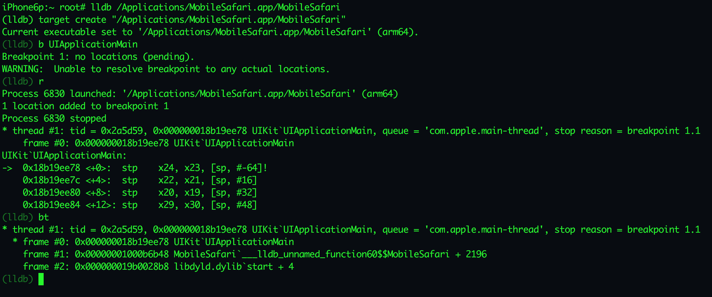

# Native LLDB(v3.8) for iOS

## Warning: !!! ON YOUR OWN RISK !!!
1. Only tested on iOS 9.0.2, ARM64, untethered jailbreak.
2. Do not use it on tethered jailbreak device, it may break the system, and cause white apple.
3. If you do want to use it on tethered jailbreak device, I suggest that unpacking deb and install it manually, make sure not overriding any system library.

## Install
1. `dpkg -i python-v2.7.6-proteas-2015-11-30.deb`
2. `dpkg -i lldb-v3.8.0-proteas-2015-12-16.deb`

## Uninstall
1. `dpkg -r python`
2. `dpkg -r lldb`

## Known Issues
1. omit messages which outputting to stdout & stderr.

## Hash
* python-v2.7.6-proteas-2015-11-30.deb: 50d3fa7d260e2d5f5fab071bfff3e7e4
* lldb-v3.8.0-proteas-2015-12-16.deb: 27b951e2464746227dd9f984832afa97

## Note
My lldb compiling env is broken, so I can't fix any issue.

